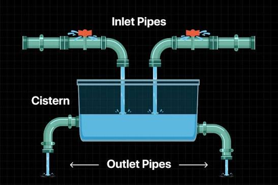
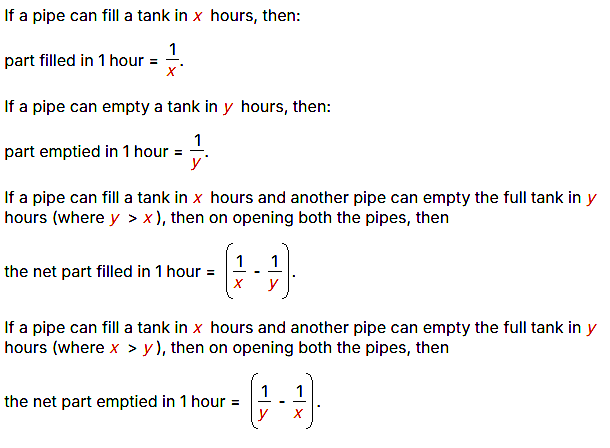

# Slide-by-slide reference — Pipes and Cisterns

**Original deck:** `pipesandcisterns3rdsem.pptx`
**Slides:** 35

Every source slide is numbered below. Text is extracted from its text boxes and tables; image objects are linked in reading order. Slide graphics can have data and equations that are not present as editable text.

## Slide 01

### On-slide text

- PIPES & CISTERNS
- K . Deepika
- Aptitude Trainer
- Department of Training & Placement
- Aditya University

## Slide 02

### On-slide text

- 2
- INTRODUCTION
- A pipe is a passage through which water flows, and a cistern (or tank) is a container used to store water.
- There are two types of pipes:
- Inlet: A pipe that fills a tank with water.
- Outlet: A pipe that empties or drains water from a tank.

### Original visuals / picture-based questions

## Slide 03

### On-slide text

- 3
- FORMULA

### Original visuals / picture-based questions

## Slide 04

### On-slide text

- 4
- KEY POINTS

### Original visuals / picture-based questions

## Slide 05

### On-slide text

- 5
- 1) Pipe A fills a tank in 20 hours and Pipe B fills it in 30 hours. How long will they take together to fill the tank?
- 12hrs
- 15hrs
- 18hrs
- 11hrs

### Original visuals / picture-based questions

## Slide 06

### On-slide text

- 6
- 2)
- Pipes A and B can fill a tank in 5 and 6 hours respectively. Pipe C can empty it in 12 hours. If all the three pipes are opened together, then the tank will be filled in how many hours?
- A) 1(13/17) hours
- B) 2(8/11) hours
- C) 3(9/17) hours
- D) 4(1/2) hours

## Slide 07

### On-slide text

- 7
- 3) A tank is filled by a pipe in 5 hours. After 2 hours, what fraction of the tank is filled?
- 1/5
- 3/4
- 3/5
- 2/5

## Slide 08

### On-slide text

- 8
- 4) Three pipes A, B and C can fill a tank from empty to full in 30 minutes, 20 minutes, and 10 minutes respectively. When the tank is empty, all the three pipes are opened. A, B and C discharge chemical solutions P,Q and R respectively. What is the proportion of the solution R in the liquid in the tank after 3 minutes?
- 5/12
- 2/15
- 7/18
- 6/11

### Original visuals / picture-based questions

## Slide 09

### On-slide text

- 9
- 5) Pipe A fills a tank in 10 hours and pipe B fills it in 15 hours, Pipe C empties it in 30 hours. All are opened together and after 3 hours, pipe C is closed. How much more time is needed?
- 3hr36min
- 4hr35min
- 6hr40min
- 7hr15min

## Slide 10

### On-slide text

- 10
- 6) How long will it take to empty the tank if both the inlet pipe A and the outlet pipe B are opened simultaneously?
- A can fill the tank in 16 minutes.
- B can empty the full tank in 8 minutes.
- A)I alone sufficient while II alone not sufficient to answer
- B)II alone sufficient while I alone not sufficient to answer
- C)Either I or II alone sufficient to answer
- D)Both I and II are not sufficient to answer
- E)Both I and II are necessary to answer

## Slide 11

### On-slide text

- 11
- 7) Three pipes A, B and C can fill a tank in 6 hours. After three pipes worked for 2 hours C is closed. Then A and B filled the remaining part in 7 hours. Calculate the number of hours taken by C alone to fill the tank is?
- A) 16 hours
- B) 12 hours
- C) 13 hours
- D) 14 hours

## Slide 12

### On-slide text

- 12
- 8) A pump can fill a tank with water in 2 hours. Because of a leak, it took 2 hours20minutes to fill the tank. The leak can drain all the water of the tank in how many hours?
- A) 4(1/3) hours
- B) 7 hours
- C) 8(2/3) hours
- D) 14 hours

## Slide 13

### On-slide text

- 13
- 9) Two pipes A and B can fill a cistern in 75 minutes and 45 minutes and both pipes are opened. The cistern will be filled in just half an hour, if the B is turned off after how many minutes
- A)5 min
- B)9 min
- C)10 min
- D)27 min

## Slide 14

### On-slide text

- 14
- 10) A large tanker can be filled by two pipes A and B in 60 minutes and 40 minutes respectively. How many minutes will it take to fill the tanker from empty state if B is used for half the time and A and B fill it together for the other half?
- A)15 min
- B)20 min
- C)27.5 min
- D)30 min

## Slide 15

### On-slide text

- 15
- 11)A cistern has two pipes.one can fill the water in 5 hours and the other can empty it in 8 hours. In how many hours will the cistern be filled if both pipes are opened together when 3/4th of the cistern is already full of water?
- A) 10
- B) 6
- C) 3 (1/3)
- D) 13 (1/3)

## Slide 16

### On-slide text

- 16
- 12) Two Pipes A and B can fill a tank in 1 (1/2) hour and 4(1/2) hour respectively. In what time both together can fill the tank?
- 1(1/8) hours
- 2(1/4) hours
- 1 (1/4) hours
- None of these

## Slide 17

### On-slide text

- 17
- 13)A tap can fill a tank in 6 hours. After half of the tank is filled, three more similar taps are opened. What is the total time taken to fill the tank completely?
- A)3hr15min.
- B)3hr45min.
- C)4hr10min.
- D)4hr15 min.

## Slide 18

### On-slide text

- 18
- 14) A tank is fitted with two taps A and B. A can fill the tank completely in 45 minutes and B can empty the full tank in 1 hour. If both the taps are opened alternately for 1 minute each, how long will it take to fill the empty tank?
- 2 hours 55 minutes
- B) 5 hours 53 minutes
- C) 3 hours 40 minutes
- D) 4 hours 48 minutes

## Slide 19

### On-slide text

- 19
- 15) Two pipes A and B can fill a cistern in 37 minutes and 45 minutes and both pipes are opened. The cistern will be filled in just half an hour, if the B is turned off after how many minutes (approx.)
- A)5 min.
- B)9 min.
- C)10 min.
- D)15 min.

## Slide 20

### On-slide text

- 20
- 16) A leak in the bottom of a tank can empty it in 6 hours. A pipe fills water at 4 litres per minute. When the tank is full, the inlet is opened but due to the leak, the tank empties in 10 hours. What is the capacity of the tank?
- 3600 litres
- B) 4200 litres
- C) 5400 litres
- D) 6000 litres

## Slide 21

### On-slide text

- 21
- 17) One fill pipe A is 3 times faster than second fill pipe B and takes 32 minutes less than the fill pipe B to fill the tank. When will the tank be full if both pipes are opened together?
- A) 10 minutes
- B) 12 minutes
- C) 15 minutes
- D) 16 minutes

## Slide 22

### On-slide text

- 22
- 18)Two pipes can fill a tank in 15 and 12 hours respectively and a third pipe can empty it in 4 hours. If the pipes are opened in order at 8 am, 9 am and 11 am respectively, the tank will be emptied at
- 11:40 am
- B) 12:40 pm
- C) 1:40 pm
- D) 2:40 pm

## Slide 23

### On-slide text

- 23
- 19)Two pipes A and B can fill a tank in 12 hours and 15 hours respectively. A third pipe C can empty the full tank in 20 hours. If all three pipes are opened together at 7 am and pipe B is closed at 10 am, at what time in the next day will the tank be full?
- A) 2:00 pm
- B) 1:00 pm
- C) 3:00 am
- D) 7:00 am

## Slide 24

### On-slide text

- 24
- 20)Twelve pipes are fitted to a tank. Some of these are inlet pipes and others are outlet pipes. Each inlet pipe can fill the tank in 6 hours and each outlet pipe can empty the tank in 12 hours. If all pipes are opened together, the tank is filled in 4 hours. Find the number of inlet pipes.
- A)4
- B)5
- C)6
- D)7

## Slide 25

### On-slide text

- 25
- 21) A booster pump can be used for filling as well as for emptying a tank. The capacity of the tank is 2400 m3. The emptying capacity of the pump is 10 m3 per minute higher than its filling capacity and the pump needs 8 minutes less to empty the tank than to fill it. What is the filling capacity?
- A) 40 m3 per min
- B) 50 m3 per min
- C) 60 m3 per min
- D) 70 m3 per min

## Slide 26

### On-slide text

- 26
- 22) A cistern is provided with 10 pipes. Some are inlets and the rest are outlets. Each inlet can fill the cistern in 8 hours and each outlet can empty it in 6 hours. If all pipes are opened together, a full cistern is emptied in 2 hours. How many outlet pipes are there?
- A) 3
- B) 2
- C) 6
- D) 7

## Slide 27

### On-slide text

- 27
- 23) A water tank has 3 outlet taps A, B, C. A fills 4 pots in 24 minutes. B fills 8 pots in 1 hour. C fills 2 pots in 20 minutes. A full tank is emptied in 2 hours if all the taps are opened together. What is the capacity of the tank, if the pot can hold 7 liters of water?
- A) 336L
- B) 332L
- C) 340L
- D) 372L

## Slide 28

### On-slide text

- 28
- 24)A fill pipe takes 20 hours and a drain pipe takes 30 hours to affect a tank. If a system of n pipes (including both fill and drain pipes) fills the tank in 5 hours, what is a possible value for n?
- A) 4
- B) 9
- C) 2
- D) 8

## Slide 29

### On-slide text

- 29
- 25) Three pipes A, B and C are attached to a cistern. A and B can fill it in 20 and 30 minutes respectively, while C can empty it in 15 minutes. If A, B and C are opened successively for 1 minute each, how long will it take to fill the cistern? (In minutes)
- A) 167
- B) 180
- C) 163
- D) 171

## Slide 30

### On-slide text

- 30
- 26)A leak in the bottom of a tank can empty it in 9 hours. A tap is turned on which admits 5 liters of water per minute into the tank. With both open, the tank is emptied in 12 hours. What is the capacity of the tank?
- A) 17600 litres
- B) 12500 litres
- C) 10800 litres
- D) 13400 litres

## Slide 31

### On-slide text

- 31
- 27) A tap can fill a tank in 8 hours. After half of the tank is filled by it two more similar taps and a tap which can empty that tank in 12 hours are opened. The time needed in hours, to fill the tank completely is:
- A) 5
- B) 5 (1/7)
- C) 5 (5/7)
- D) 6 (6/7)

## Slide 32

### On-slide text

- 32
- 28) A pipe of diameter 'd' can drain a water tank in 40 minutes. The time taken by a pipe of diameter '2d' for doing the same job is (in minutes)
- A)10min
- B)15min
- C)5 min
- D)20min

## Slide 33

### On-slide text

- 33
- 29) A pipe can fill a tank in 8 hours, but due to leakage in the bottom, it takes 10 hours to fill the tank. In how many hours the leak can empty the full tank?
- A)18 hours
- B) 8 hours
- C) 40 hours
- D) 10 hours

## Slide 34

### On-slide text

- 34
- 30) A pipe fills 1⁄3rd of a tank in 10 minutes. In what time would it fill 5⁄6th of the tank?
- 20 min
- B) 25 min
- C) 30 min
- D)18 min

## Slide 35

### On-slide text

- Thank You

