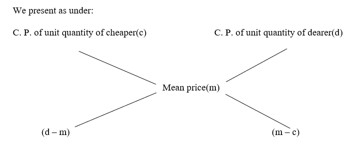

# Slide-by-slide reference — Mixture and Alligation

**Original deck:** `MIXTURE & ALLIGATION.pptx`
**Slides:** 34

Every source slide is numbered below. Text is extracted from its text boxes and tables; image objects are linked in reading order. Slide graphics can have data and equations that are not present as editable text.

## Slide 01

### On-slide text

- MIXTURE & ALLIGATION
- Mrs. G. Devi
- Aptitude Trainer
- Department of Training & Placement
- Aditya University

## Slide 02

### On-slide text

- 2

## Slide 03

### On-slide text

- 3

### Original visuals / picture-based questions

## Slide 04

### On-slide text

- 4
- Solved Examples:
- The average weight of 30 students of a class is 45 kg. The average weight of girls is 37 kg, and that of boys is 49 kg. Find the number of boys in the class. a) 10			b) 15			c) 20			d) 22
- Questions

## Slide 05

### On-slide text

- 5
- Solved Examples:
- How many kilograms of sugar costing ₹ 9 per kg must be mixed with 27 kg of sugar costing ₹ 7 per kg so that there may be a gain of 10% by selling the mixture at ₹ 9.24 per kg?a) 60 kg		b) 63 kg		c) 58 kg		d) 56 kg
- Questions

## Slide 06

### On-slide text

- 6
- Solved Examples:
- A merchant sells 50 kg of a commodity—partly at 10% profit and the rest at 15% profit. If profit in the deal is 13%, then the quantity sold at 10% profit is : a) 20 kg		b) 25 kg		c) 30 kg		d) 40 kg
- Questions

## Slide 07

### On-slide text

- 7
- Solved Examples:
- A merchant mixes two varieties of wine containing 25% and 13% alcohol. The resultant mixture contains 17% alcohol. Find the quantity of second mixture, if 8 litre of first mixture is taken. a) 4 litres		b) 16 litres		c) 24 litres		d) 32 litres
- Questions

## Slide 08

### On-slide text

- 8
- Solved Examples:
- A 20-litre mixture contains 30% alcohol and 70% water. If 5 litres of water is added to the mixture, what will be the percentage of alcohol in the new mixture?a) 22%			b) 23%			c) 24%			d) 25%
- Questions

## Slide 09

### On-slide text

- 9
- Solved Examples:
- The wheat sold by a grocer contained 10% low quality wheat. What quantity of good quality wheat should be added to 150 kgs of wheat so that the percentage of low-quality wheat becomes 5%?a) 150 kgs		b) 135 kgs		c) 50 kgs		d) 85 kgs
- Questions

## Slide 10

### On-slide text

- 10
- Solved Examples:
- In a mixture of one kind, pure milk is 70%. In another pure milk is 60%. If they are mixed in the ratio 3 : 2, how much is the percentage of pure milk in the new mixture?a) 65%			b) 74%			c) 66%			d) 67%
- Questions

## Slide 11

### On-slide text

- 11
- Solved Examples:
- A mixture of 70 litres of wine and water contains 10% water. How much more water should be added to the mixture to make 37% water in the resulting mixture?a) 37 litres		b) 30 litres		c) 27 litres		d) 18.9 litres
- Questions

## Slide 12

### On-slide text

- 12
- Solved Examples:
- In a town, the population was 8000. In one-year, male population increased by 10% and female population increased by 8%, but the total population increased by 9%. The number of males in the town was: a) 4000			b) 4500		c) 5000		d) 6000
- Questions

## Slide 13

### On-slide text

- 13
- Solved Examples:
- In what ratio must tea worth ₹ 60 per kg be mixed with tea worth ₹ 65 a kg such that by selling the mixture at ₹ 68.20 a kg, there can be a gain of 10%?a) 3 : 2			b) 2 : 3			c) 4 : 3			d) 3 : 4
- Questions

## Slide 14

### On-slide text

- 14
- Solved Examples:
- The average of the test scores of a class of m students is 70 and that of n students is 91. When the score of both the classes is combined, the average is 80. What is n/m?a) 10/13			b) 10/11		c) 11/10		d) 13/10
- Questions

## Slide 15

### On-slide text

- 15
- Solved Examples:
- The average of marks scored by the students of a class is 68. The average of marks of the girls in the class is 80 and that of boys is 60. What is the percentage of boys in the class?a) 40%			b) 60%			c) 65%			d) 70%
- Questions

## Slide 16

### On-slide text

- 16
- Solved Examples:
- A class of 60 students contributed ₹4800 for a charity. If each boy has contributed ₹94 and each girl contributed ₹73. Find the number of boys in the class. a) 20			b) 30			c) 40			d) 45
- Questions

## Slide 17

### On-slide text

- 17
- Solved Examples:
- In a mixture of 60 litres, the ratio of acid to base is 2 : 1. If this ratio is to be 1 : 2, then the quantity of base (in litres) to be further added is : a) 20			b) 30			c) 40			d) 60
- Questions

## Slide 18

### On-slide text

- 18
- Solved Examples:
- A man had 100 kgs of sugar, part of which he sold at 7% profit and rest at 17% profit. He gained 10% on the whole. How much did he sell at 7% profit?a) 65 kg			b) 35 kg		c) 30 kg		d) 70 kg
- Questions

## Slide 19

### On-slide text

- 19
- Solved Examples:
- A merchant sold 80 dozen oranges. He sold some at 4% loss and rest at the cost price and thus losing 3% on the whole. What is the quantity sold at loss?a) 20 dozen		b) 40 dozen		c) 50 dozen		d) 60 dozen
- Questions

## Slide 20

### On-slide text

- 20
- Solved Examples:
- 40 litres of a mixture of milk and water contains 10% of water. How much water should be added to make the water content 20% in the new mixture?a) 6 litres		b) 6.5 litres		c) 5.5 litres		d) 5 litres
- Questions

## Slide 21

### On-slide text

- 21
- Solved Examples:
- The mean weight of a class of 65 students is 59 kg. If the mean weight of boys is 63 kg and that of girls is 50 kg, find the number of boys and girls in the class. a) 45, 25			b) 45, 20		c) 40, 20		d) 50, 20
- Questions

## Slide 22

### On-slide text

- 22
- Solved Examples:
- A man purchased a horse and a cow for ₹5000. He sells the horse at 20% profit and the cow at 10% loss. If he gains 2% on the whole transaction, the cost price of the horse is : a) ₹2000			b) ₹2500		c) ₹2800		d) ₹3000
- Questions

## Slide 23

### On-slide text

- 23
- Solved Examples:
- In a family of 8 adults and some minors, the average consumption of rice per head per month is 10.8 kg. The average consumption for adults is 15 kg and for minors is 6 kg. The number of minors is: a) 8			b) 6			c) 7			d) 9
- Questions

## Slide 24

### On-slide text

- 24
- Solved Examples:
- Fresh fruit contains 70% water and dry fruit contains 40% water. How much dry fruit can be obtained from 100 kg of fresh fruit?a) 50 kg			b) 30 kg		c) 35 kg		d) 72 kg
- Questions

## Slide 25

### On-slide text

- 25
- Solved Examples:
- The mean weight of 150 students is 60 kg. The mean weight of boys is 70 kg and girls is 55 kg. Find the number of girls. a) 105			b) 100			c) 95			d) 60
- Questions

## Slide 26

### On-slide text

- 26
- Solved Examples:
- The average salary per head of all workers is ₹60. The average salary of 12 officers is ₹400 and of the rest is ₹56. The total number of workers is: a) 1062			b) 1060		c) 1030		d) 1032
- Questions

## Slide 27

### On-slide text

- 27
- Solved Examples:
- The average salary of factory staff is ₹3500. The average salary of workers is ₹2000 and supervisors ₹7000. If there are 900 employees, find the number of supervisors. a) 200			b) 270			c) 630			d) 700
- Questions

## Slide 28

### On-slide text

- 28
- Solved Examples:
- How much pure alcohol must be added to 400 ml of a solution containing 15% alcohol to make it 32% alcohol?a) 60 ml		b) 100 ml		c) 128 ml		d) 68 ml
- Questions

## Slide 29

### On-slide text

- 29
- Solved Examples:
- 10 gallons are drawn from a container full of alcohol and filled with water again. 10 gallons of mixture are again drawn and the container is filled with water again. If the ratio of alcohol and water left in the container is 49 : 32, then find how much quantity does the container hold?a) 35 gallons	b) 45 gallons	c) 55 gallons	d) 60 gallons
- Questions

## Slide 30

### On-slide text

- 30
- Solved Examples:
- Mira’s expenditure and savings are in the ratio 3 : 2. Her income increases by 10% and expenditure by 12%. By how much percent does her saving increase?a) 7%			b) 10%			c) 9%			d) 13%
- Questions

## Slide 31

### On-slide text

- 31
- Solved Examples:
- A sample of 50 litres of glycerine is found to be adulterated to the extent of 20%. How much pure glycerine should be added to it so as to bring down the percentage of impurity to 5%?a) 155 litres		b) 150 litres		c) 150. 4 litres		d) 149 litres
- Questions

## Slide 32

### On-slide text

- 32
- Solved Examples:
- In a class there are 150 students. 60% of boys are passed while 45% of girls are passed. The pass percentage of class is 55%. Find the number of girls in the class. a) 50			b) 100			c) 115			d) None of these
- Questions

## Slide 33

### On-slide text

- 33
- Solved Examples:
- In a zoo there are rabbits and pigeons. If their heads are counted, they are 35 while their legs are 120. Find the number of rabbits in the zoo. a) 25			b) 15			c) 10			d) None of these
- Questions

## Slide 34

### On-slide text

- Thank You
- 34

