# Slide-by-slide reference — Puzzles, Numbers and Symbols

**Original deck:** `Puzzles_Numbers_and_Syllabus.pptx`
**Slides:** 31

Every source slide is numbered below. Text is extracted from its text boxes and tables; image objects are linked in reading order. Slide graphics can have data and equations that are not present as editable text.

## Slide 01

### On-slide text

- Puzzles
- Numbers and Symbols
- Paluri Hari
- Aptitude Trainer
- Department of Training & Placement
- Aditya University

## Slide 02

### On-slide text

- Sunday, 20 September 2026
- PALURI HARI                 APTITUDE TRAINER        ADITYA UNIVERSITY
- 2
- What is a Puzzle?
- A puzzle is a reasoning problem in which several pieces of information are given, and we have to determine the unknown arrangement, position, order, relationship, or outcome.
- Basic Approach:
- Read → Understand → Organize → Apply Conditions → Eliminate → Solve
- PUZZLES

## Slide 03

### On-slide text

- Sunday, 20 September 2026
- PALURI HARI                 APTITUDE TRAINER        ADITYA UNIVERSITY
- 3
- Major Types of Puzzles
- Floor-Based Puzzles
- Box/Stacking Puzzles
- Day/Month/Year-Based Puzzles
- Ranking & Ordering Puzzles
- Blood Relation-Based Puzzles
- Comparison-Based Puzzles
- Selection & Grouping Puzzles
- Mixed-Condition Puzzles
- Etc

## Slide 04

### On-slide text

- Sunday, 20 September 2026
- PALURI HARI                 APTITUDE TRAINER        ADITYA UNIVERSITY
- 4
- 1.Ques) Each of P, Q, R, S, T, U and V has an exam on a different day of a week starting from Monday and ending on Sunday of the same week. R has an exam on Thursday. Exactly 4 people have their exam between U and T, neither of whom has an exam on Sunday. S has an exam immediately before Q. P does not have an exam on Friday. U does not have an exam after Q. How many people have an exam after Q? (RRB NTPC –G –CBT1)
- Four
- One
- Two
- Three
- PUZZLES

## Slide 05

### On-slide text

- Sunday, 20 September 2026
- PALURI HARI                 APTITUDE TRAINER        ADITYA UNIVERSITY
- 5
- 2.Ques) Seven boxes, D, E, F, G, S, T and U, are kept one over the other but not necessarily in the same order. Only three boxes are kept above G. Only one box is kept between T and G. Only three boxes are kept between T and S. S is kept at some place above G. E is kept immediately below S. F is kept at one of the places above D. U is not kept immediately above or below T. Which box is kept at the lowermost position? (RRB NTPC –G –CBT1)
- D
- U
- T
- F
- PUZZLES

## Slide 06

### On-slide text

- Sunday, 20 September 2026
- PALURI HARI                 APTITUDE TRAINER        ADITYA UNIVERSITY
- 6
- 3.Ques) Each of P, Q, R, S, T, U and V has an exam on a different day of a week starting from Monday and ending on Sunday of the same week. S has an exam on Tuesday. Exactly two people have an exam between S and P. T has an exam immediately before U and R has an exam immediately after Q. Only 1 person has an exam between U and Q. How many people have exams after Q (RRB NTPC –G –CBT2)
- Four
- One
- Two
- Three
- PUZZLES

## Slide 07

### On-slide text

- Sunday, 20 September 2026
- PALURI HARI                 APTITUDE TRAINER        ADITYA UNIVERSITY
- 7
- 4.Ques) Seven boxes U, V, W, X, E, F and G are kept one over the other but not necessarily in the same order. Only two boxes are kept below G. Only one box is kept above V. Only one box is kept between V and U. X is kept immediately above P. W is kept at some place below E. How many boxes are kept between E and X? (NTPC UG CBT2)
- Four
- One
- Two
- Three
- PUZZLES

## Slide 08

### On-slide text

- Sunday, 20 September 2026
- PALURI HARI                 APTITUDE TRAINER        ADITYA UNIVERSITY
- 8
- 5.Ques) Each of seven colleagues, A, B, C, D, E, F and G, travelled to USA for sales presentation in the months of April, May, June, July, August, September and October, in the year 2019, but not necessarily in the same order. Each colleague travelled in a different month. Exactly four people travelled after D’s trip. C travelled between the trips of E and F. G travelled in the month immediately before A’s trip. Exactly two people travelled after C’s trip. E travelled in the month immediately before B, who travelled in the month of October. Who travelled in the month of July?   A)D B)C C)A D)F
- PUZZLES

## Slide 09

### On-slide text

- Sunday, 20 September 2026
- PALURI HARI                 APTITUDE TRAINER        ADITYA UNIVERSITY
- 9
- 6.Ques) Six persons, Aditya, Binod, Chaya, Dilshan, Estar and Fatima, travelled in different months of the same year viz. January, March, May, July, September and November. None of them travelled after Binod, who travelled immediately after Chaya. Only three people travelled before Estar. Aditya travelled immediately after Fatima. Dilshan did not travel in the month of May. Who among them travelled in May?
- A)Fatima B)Estar C)Aditya D)Chaya
- PUZZLES

## Slide 10

### On-slide text

- Sunday, 20 September 2026
- PALURI HARI                 APTITUDE TRAINER        ADITYA UNIVERSITY
- 10
- 7.Ques) Six people live in a three story building. The ground floor is numbered 1 and the floor above it numbered 2 and so on. Each floor consists of two flats i.e. Flat X and Flat Y. Flat X of floor 2 is just above Flat X of floor 1 and just below Flat X of floor 3. Flat X is in the west of Flat Y. S, who lives in Flat X, lives adjacent to the floor where T lives, but in a different Flat. T and V live on the same floor. Q lives to the southeast of V. Only one person lives between P and S in the same Flat. R does not live on the floor where S lives.
- PUZZLES

## Slide 11

### On-slide text

- Sunday, 20 September 2026
- PALURI HARI                 APTITUDE TRAINER        ADITYA UNIVERSITY
- 11
- 1)Who lives adjacent to T?
- A)V B)S C)Q D)R
- 2)Who is to the North East of V? A)R B)P C)T D)S
- 3)Who is living to west of Flat-Y In Floor 3?
- A)P B)V C)S D)R
- PUZZLES

## Slide 12

### On-slide text

- Sunday, 20 September 2026
- PALURI HARI                 APTITUDE TRAINER        ADITYA UNIVERSITY
- 12
- 8.Ques) A person wears seven different colors of shirts Black, Blue, Brown, Maroon, Pink, Red and Yellow on seven different days of the week starting from Monday to Sunday. Brown shirt was worn on one of the days after Wednesday and immediately before the day on which Black shirt was worn. Only three days are there between the days on which Black and Pink shirt was worn. The number of days before the day on which Pink shirt was worn is same as the number of days after the day on which Red shirt was worn. Maroon shirt was worn immediately after the day on which Blue shirt was worn which was not worn the first.
- PUZZLES

## Slide 13

### On-slide text

- Sunday, 20 September 2026
- PALURI HARI                 APTITUDE TRAINER        ADITYA UNIVERSITY
- 13
- 1)Which color comes two days after Monday?
- a)Maroon b)Brown c)Black d)Yellow
- 2)Which color is on Sunday? A)Maroon b)Brown c)Black d)Red
- 3)How many colors are between Blue and Yellow?
- a)Two b)Three c)one d)more than three
- PUZZLES

## Slide 14

### On-slide text

- Sunday, 20 September 2026
- PALURI HARI                 APTITUDE TRAINER        ADITYA UNIVERSITY
- 14
- 9. Ques)
- PUZZLES

### Original visuals / picture-based questions

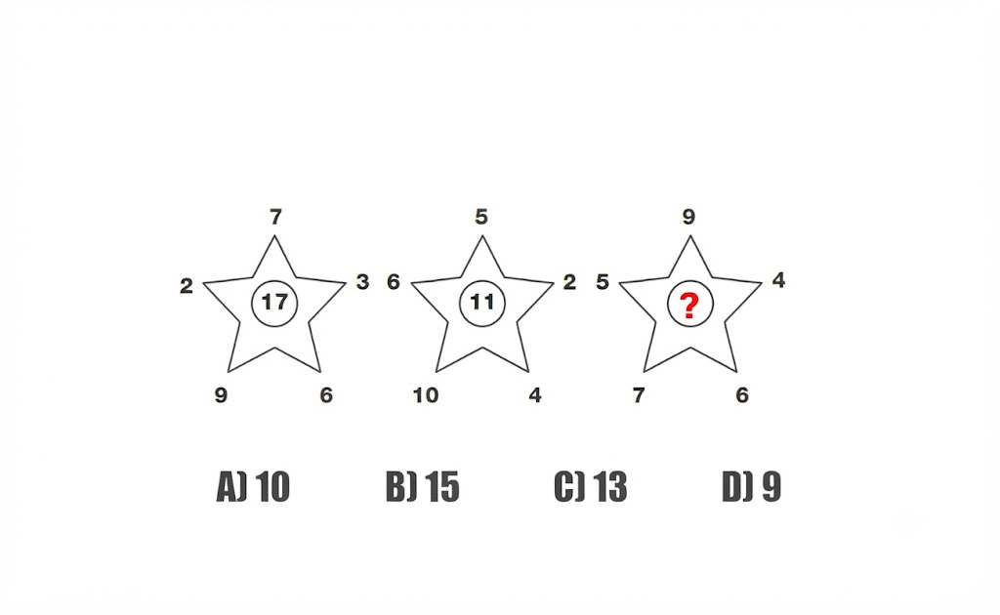

## Slide 15

### On-slide text

- Sunday, 20 September 2026
- PALURI HARI                 APTITUDE TRAINER        ADITYA UNIVERSITY
- 15
- 10. Ques)
- PUZZLES

### Original visuals / picture-based questions

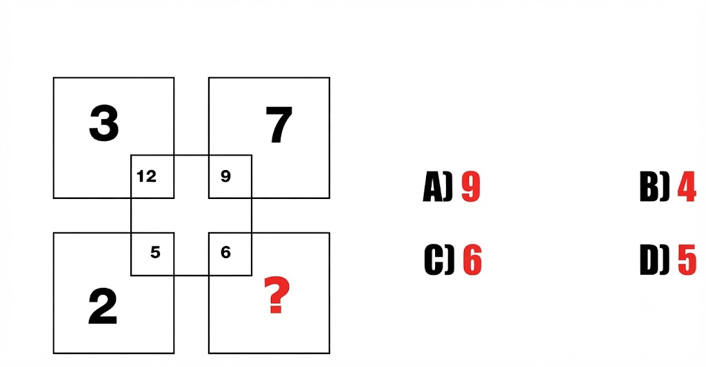

## Slide 16

### On-slide text

- Sunday, 20 September 2026
- PALURI HARI                 APTITUDE TRAINER        ADITYA UNIVERSITY
- 16
- 11. Ques)
- PUZZLES

### Original visuals / picture-based questions

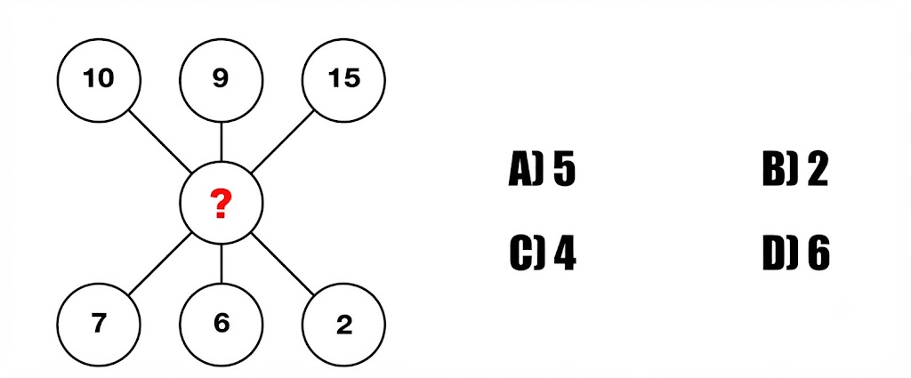

## Slide 17

### On-slide text

- Sunday, 20 September 2026
- PALURI HARI                 APTITUDE TRAINER        ADITYA UNIVERSITY
- 17
- 12. Ques)
- PUZZLES

### Original visuals / picture-based questions

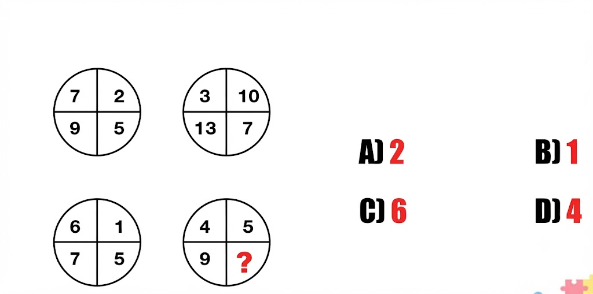

## Slide 18

### On-slide text

- Sunday, 20 September 2026
- PALURI HARI                 APTITUDE TRAINER        ADITYA UNIVERSITY
- 18
- 13. Ques)
- PUZZLES

### Original visuals / picture-based questions

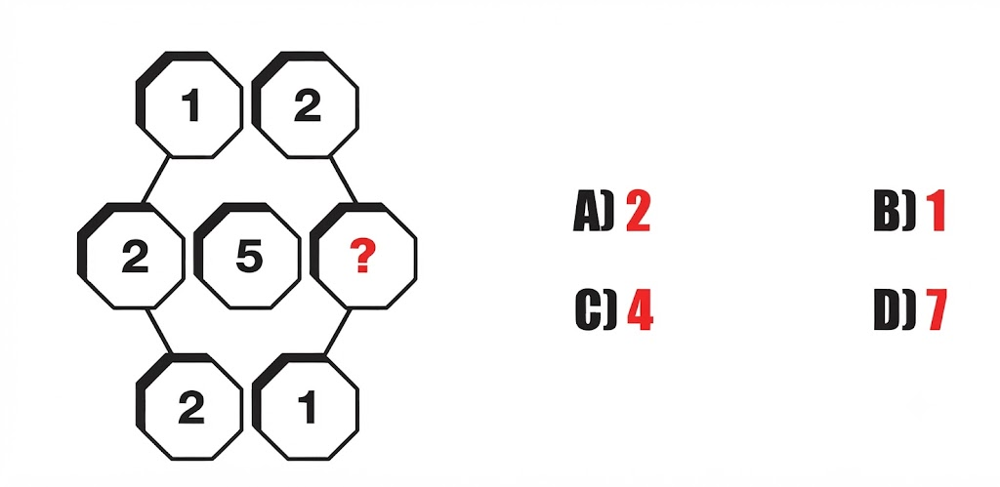

## Slide 19

### On-slide text

- Sunday, 20 September 2026
- PALURI HARI                 APTITUDE TRAINER        ADITYA UNIVERSITY
- 19
- 14. Ques)
- PUZZLES

### Original visuals / picture-based questions

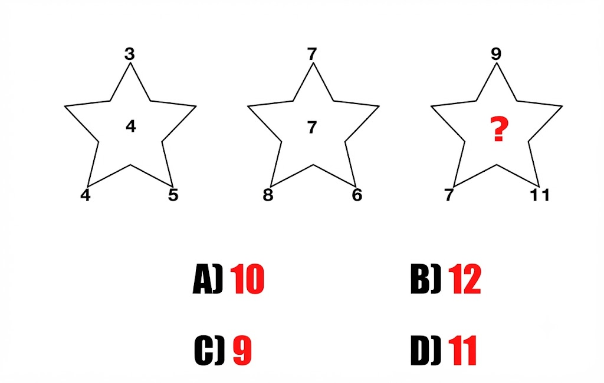

## Slide 20

### On-slide text

- Sunday, 20 September 2026
- PALURI HARI                 APTITUDE TRAINER        ADITYA UNIVERSITY
- 20
- 15. Ques)
- PUZZLES

### Original visuals / picture-based questions

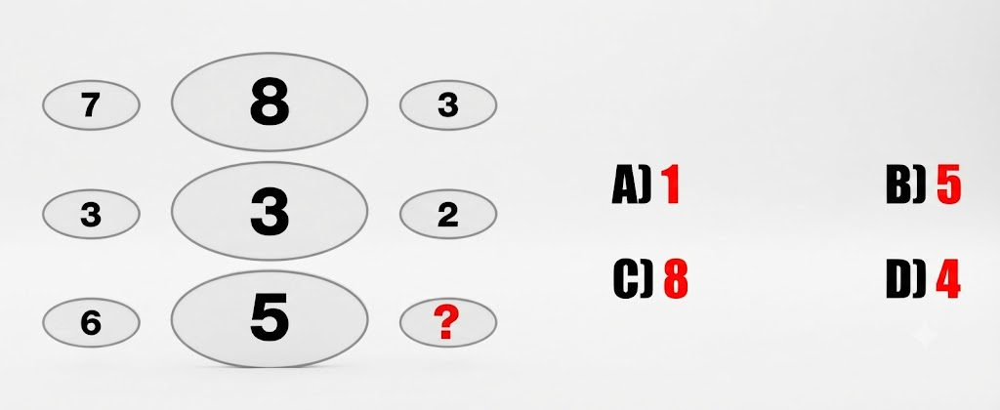

## Slide 21

### On-slide text

- Sunday, 20 September 2026
- PALURI HARI                 APTITUDE TRAINER        ADITYA UNIVERSITY
- 21
- 16. Ques)
- PUZZLES

### Original visuals / picture-based questions

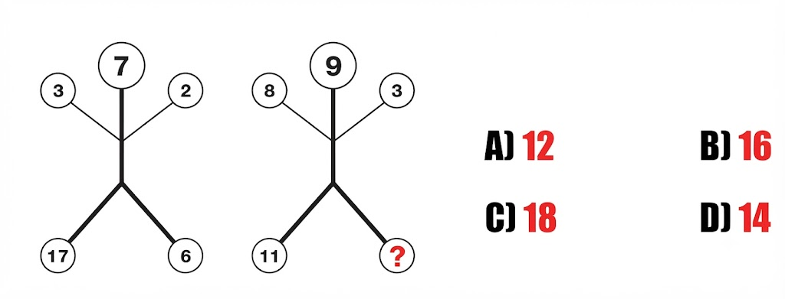

## Slide 22

### On-slide text

- Sunday, 20 September 2026
- PALURI HARI                 APTITUDE TRAINER        ADITYA UNIVERSITY
- 22
- 17. Ques)
- PUZZLES

### Original visuals / picture-based questions

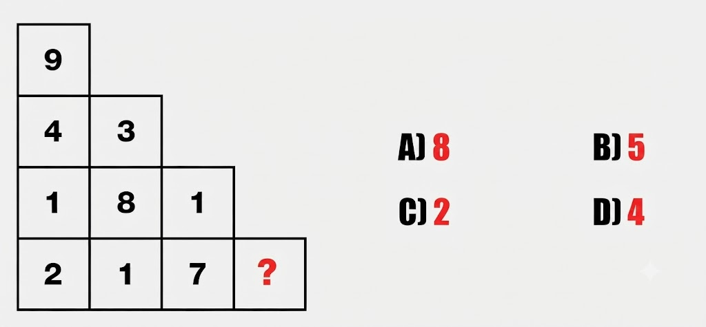

## Slide 23

### On-slide text

- Sunday, 20 September 2026
- PALURI HARI                 APTITUDE TRAINER        ADITYA UNIVERSITY
- 23
- 18. Ques)
- PUZZLES

### Original visuals / picture-based questions

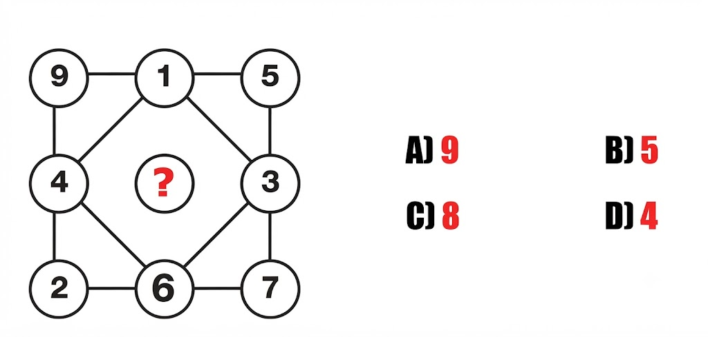

## Slide 24

### On-slide text

- Sunday, 20 September 2026
- PALURI HARI                 APTITUDE TRAINER        ADITYA UNIVERSITY
- 24
- 19. Ques)
- PUZZLES

### Original visuals / picture-based questions

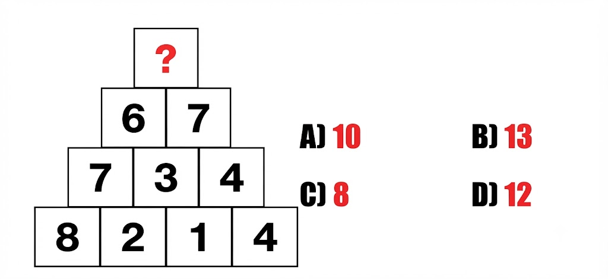

## Slide 25

### On-slide text

- Sunday, 20 September 2026
- PALURI HARI                 APTITUDE TRAINER        ADITYA UNIVERSITY
- 25
- 20. Ques)
- PUZZLES

### Original visuals / picture-based questions

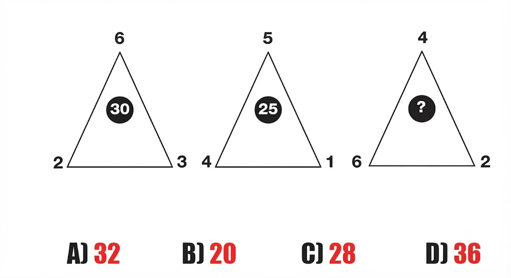

## Slide 26

### On-slide text

- Sunday, 20 September 2026
- PALURI HARI                 APTITUDE TRAINER        ADITYA UNIVERSITY
- 26
- 21. Ques)
- If:
- + means ×− means +× means ÷÷ means −
- then find:
- 12 + 3 − 4 × 2 = ?
- A) 34B) 36C) 38D) 40
- NUMBERS AND SYMBOLS

## Slide 27

### On-slide text

- Sunday, 20 September 2026
- PALURI HARI                 APTITUDE TRAINER        ADITYA UNIVERSITY
- 27
- 22. Ques)
- Find the missing number:
- 2 ★ 4 = 123 ★ 5 = 204 ★ 6 = 305 ★ 7 = ?
- A) 35B) 40C) 42D) 45
- NUMBERS AND SYMBOLS

## Slide 28

### On-slide text

- Sunday, 20 September 2026
- PALURI HARI                 APTITUDE TRAINER        ADITYA UNIVERSITY
- 28
- 23. Ques)
- If:
- 3 @ 4 = 255 @ 2 = 296 @ 3 = 45
- What is:
- 7 @ 4 = ?
- A) 53B) 60C) 65D) 70
- NUMBERS AND SYMBOLS

## Slide 29

### On-slide text

- Sunday, 20 September 2026
- PALURI HARI                 APTITUDE TRAINER        ADITYA UNIVERSITY
- 29
- 24. Ques)
- If 3 ★ 4 = 255 ★ 2 = 296 ● 3 = 98 ● 5 = 134 ▲ 3 = 137 ▲ 2 = 15
- Find the value of:
- (7 ★ 3) − (9 ● 4) + (5 ▲ 2)
- A) 48B) 56C) 52D) 54
- NUMBERS AND SYMBOLS

## Slide 30

### On-slide text

- Sunday, 20 September 2026
- PALURI HARI                 APTITUDE TRAINER        ADITYA UNIVERSITY
- 30
- 25. Ques)
- Answer the following questions based on the arrangement given below:
- B @ C 7 N R % 5 $ G 6 K M & 4 S # P U 5
- Q1. If the symbols followed by consonants interchange their positions within the group, then which element is third from the right end? (a) U (b) # (c) P (d) 5
- Q2. Based on the given arrangement which of the following groups should be next? BC7   R5$   6M& ?  (a) N5G (b) KS# (c) SPU (d) C4H
- Q3. Which of the following is second to the left of the twelfth from the right end if all the symbols are dropped? (a) F (b) C (c) 7 (d) B
- Q4. How many letters are there which are preceded by a symbol and followed by a number within the group in the given arrangement? (a) None (b) One (c) Two (d) Three
- NUMBERS AND SYMBOLS

## Slide 31

### On-slide text

- Thank You
- 31
- Sunday, 20 September 2026
- PALURI HARI                 APTITUDE TRAINER        ADITYA UNIVERSITY

