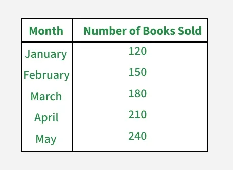
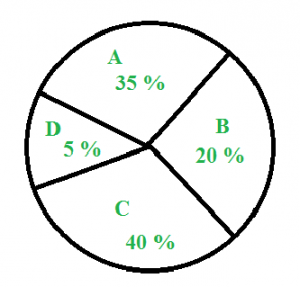
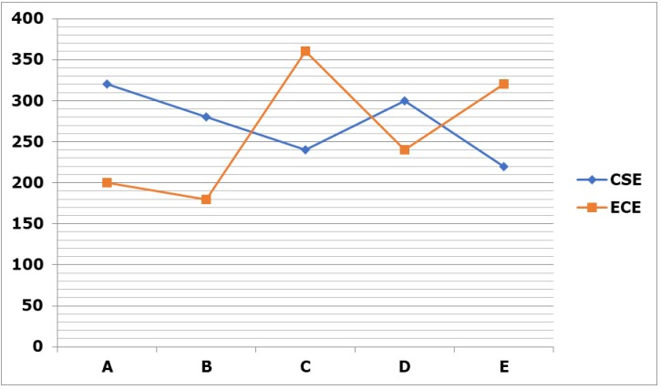
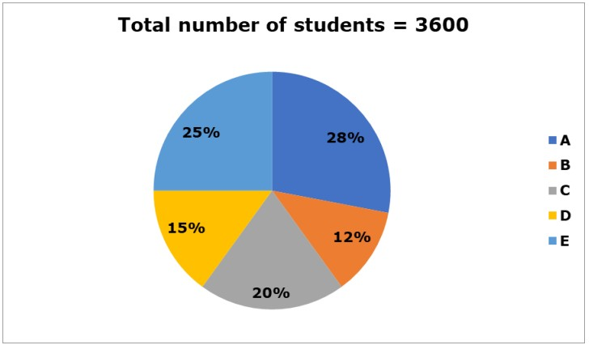
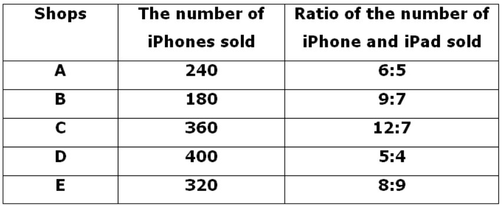
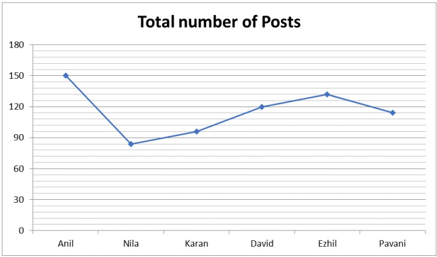
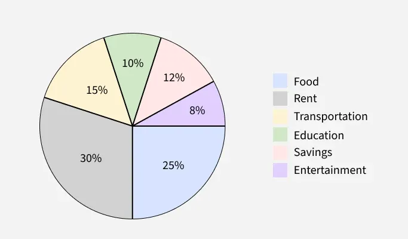
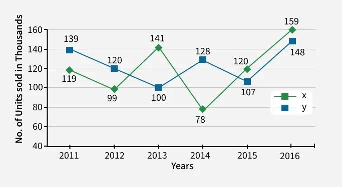
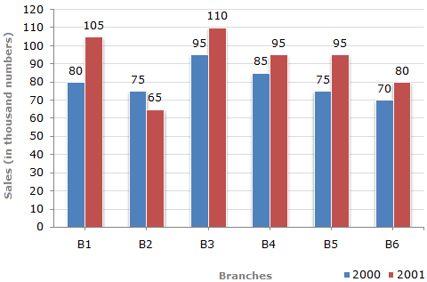
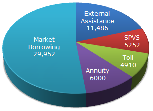

# Slide-by-slide reference — Data Interpretation

**Original deck:** `Data Interpretation Final-1.pptx`
**Slides:** 34

Every source slide is numbered below. Text is extracted from its text boxes and tables; image objects are linked in reading order. Slide graphics can have data and equations that are not present as editable text.

## Slide 01

### On-slide text

- G. Devi
- Aptitude Trainer
- Department of Training and Placements
- Aditya University
- 1
- Data Interpretation

## Slide 02

### On-slide text

- Introduction
- Definition: The process of making sense of collected data by analysing and explaining its significance in context.
- Purpose: To transform numbers, charts, or tables into clear insights that answer questions or solve problems.
- Importance of Data Interpretation
- Helps organizations and individuals make evidence-based choices.
- Converts complex datasets into understandable insights for stakeholders.

### Original visuals / picture-based questions

## Slide 03

### On-slide text

- Introduction
- Types of Data Interpretation Questions:
- Tabular DI: Data presented in tables; requires calculations like percentages, ratios.
- Graphical DI: Bar graphs, line charts, pie charts.
- Caselet DI: Data given in paragraph form; requires comprehension + calculation.
- Logical DI: Involves reasoning beyond numbers, often linked to puzzles.

### Original visuals / picture-based questions

## Slide 04

### On-slide text

- Questions
- What is the Total number of books sold in the months of March, April, may ?
- 280
- 450
- 350
- 630
- The table below shows the number of books sold by a bookstore over five months.

### Original visuals / picture-based questions

## Slide 05

### On-slide text

- Questions
- 2. What is the Difference between number of books sold in the months of January and may ?
- 120
- 150
- 100
- 130
- The table below shows the number of books sold by a bookstore over five months.

### Original visuals / picture-based questions

## Slide 06

### On-slide text

- Questions
- 3. What is the Average number of books sold in the months of January, February and march ?
- 120
- 150
- 100
- 130
- The table below shows the number of books sold by a bookstore over five months.

### Original visuals / picture-based questions

## Slide 07

### On-slide text

- Questions
- 4. What is the Total Monthly Incomes of A and C in Rs.?
- 40000
- 35000
- 75000
- 60000
- The pie chart below shows the monthly Incomes of 4 People A,B,C,D of a family (in percentage) with a total income of Rs. 1,00,000 /-

### Original visuals / picture-based questions

## Slide 08

### On-slide text

- Questions
- 5. What is the Total Monthly Incomes of B, C and D in Rs.?
- 40000
- 35000
- 75000
- 65000
- The pie chart below shows the monthly Incomes of 4 People A,B,C,D of a family (in percentage) with a total income of Rs. 1,00,000 /-

### Original visuals / picture-based questions

## Slide 09

### On-slide text

- Questions
- 6. What is the Average Monthly Incomes of A, B, C and D in Rs.?
- 40000
- 35000
- 25000
- 15000
- The pie chart below shows the monthly Incomes of 4 People A,B,C,D of a family (in percentage) with a total income of Rs. 1,00,000 /-

### Original visuals / picture-based questions

## Slide 10

### On-slide text

- Questions
- 7. What is the Total number of Students in ECE and CSE students in A and E together ?
- a) 1200                   b) 1120                    c) 1060                    d) 1250
- The given line graph shows the number of CSE and ECE students in five different colleges

### Original visuals / picture-based questions

## Slide 11

### On-slide text

- Questions
- 8. What is the Total number of CSE students in all the colleges together?
- a) 1300                   b) 1220                    c) 1200                    d) 1360
- The given line graph shows the number of CSE and ECE students in five different colleges

### Original visuals / picture-based questions

## Slide 12

### On-slide text

- Questions
- 9. What is the Average number of ECE students in all the colleges together?
- a) 240                   b) 260                    c) 220                    d) 250
- The given line graph shows the number of CSE and ECE students in five different colleges

### Original visuals / picture-based questions

## Slide 13

### On-slide text

- Questions
- 10. What is the difference between the number of ECE students in C and D together and the number of CSE students in B and E together?
- a) 90                   b) 120                    c) 100                    d) 130
- The given line graph shows the number of CSE and ECE students in five different colleges

### Original visuals / picture-based questions

## Slide 14

### On-slide text

- Questions
- 11. The number of boys and girls in class A is 4:3. Find the difference between the number of boys and girls in class A?
- a) 150                   b) 126                   c) 144                   d) 135
- The given pie chart shows the number of students in five different classes.

### Original visuals / picture-based questions

## Slide 15

### On-slide text

- Questions
- 12. What is the ratio of the number of students in D and C?
- a) 3 : 2                   b)  3 : 4                 c)  2 : 3                   d) 4 : 3
- The given pie chart shows the number of students in five different classes.

### Original visuals / picture-based questions

## Slide 16

### On-slide text

- Questions
- 13. What is the average number of students in B, C and E together?
- a) 450                   b) 426                   c) 684                   d) 535
- The given pie chart shows the number of students in five different classes.

### Original visuals / picture-based questions

## Slide 17

### On-slide text

- Questions
- 14. Find the difference between the number of iPads sold in shop A and the number of iPhones sold in shops B and D together?
- a) 380                   b) 420                   c) 280                   d) 350
- The given table chart shows the number of iPhones sold in five different shops (A, B, C, D and E) and also given the ratio of the number of iPhones and iPads sold in five different shops.

### Original visuals / picture-based questions

## Slide 18

### On-slide text

- Questions
- 15. Find the ratio of the number of iPhones and iPads sold in shop B to the number of iPhones sold in shop D?
- a) 3 : 2                     b)  3 : 4                   c)  2 : 3                     d) 4 : 5
- The given table chart shows the number of iPhones sold in five different shops (A, B, C, D and E) and also given the ratio of the number of iPhones and iPads sold in five different shops.

### Original visuals / picture-based questions

## Slide 19

### On-slide text

- Questions
- 16. The number of iPads sold in shop B is what percentage of the number of iPhones sold in shop D?
- a) 30%                    b) 40%                   c) 35%                     d) 20%
- The given table chart shows the number of iPhones sold in five different shops (A, B, C, D and E) and also given the ratio of the number of iPhones and iPads sold in five different shops.

### Original visuals / picture-based questions

## Slide 20

### On-slide text

- Questions
- 17. What is the ratio of the total number of posts shared by Karan to David?
- a) 3 : 2                     b)  3 : 4                   c)  2 : 3                     d) 4 : 5
- The given line graph shows the total number of posts (Facebook and Instagram) shared by six different persons.

### Original visuals / picture-based questions

## Slide 21

### On-slide text

- Questions
- 18. Total number of posts share by Pavani is what percent of the number of posts shared by Ezhil ?
- a) 86.36 %                  b)  86.56 %                c)  86.48 %                  d) 86.26 %
- The given line graph shows the total number of posts (Facebook and Instagram) shared by six different persons.

### Original visuals / picture-based questions

## Slide 22

### On-slide text

- Questions
- 19. The number of Instagram posts shared by Nila is 45% of the total number of posts shared by David. Find the number of Facebook posts shared by Nila?
- a) 40                             b)  36                             c)  30                                d) 42
- The given line graph shows the total number of posts (Facebook and Instagram) shared by six different persons.

### Original visuals / picture-based questions

## Slide 23

### On-slide text

- Questions
- 20. Ratio of the number of Facebook and Instagram posts shared by Anil and Karan is 3:2 and 5:3 respectively. Find the total number of Facebook posts shared by Anil and Karan?
- a) 120                            b)  130                          c)  150                                d) 180
- The given line graph shows the total number of posts (Facebook and Instagram) shared by six different persons.

### Original visuals / picture-based questions

## Slide 24

### On-slide text

- Questions
- 21. How much more is spent on Food and Rent together compared to Transportation and Education combined?
- a) 22000                      b) 22500                     c)23000                           d) 24000
- The pie chart below shows the monthly expenditure breakdown (in percentage) of a family with a total income of Rs. 75,000.

### Original visuals / picture-based questions

## Slide 25

### On-slide text

- Questions
- 22. If the Entertainment budget is reduced by half and added to Savings, what will be the new Savings amount?
- a) 12000                      b) 12500                     c)13000                          d) 15000
- The pie chart below shows the monthly expenditure breakdown (in percentage) of a family with a total income of Rs. 75,000.

### Original visuals / picture-based questions

## Slide 26

### On-slide text

- Questions
- 23. If the Total amount of Rent and Education together is equal to which of the two expenses ?
- a) Food + education   b) Food + Transportation    c) Food      d) Savings + education
- The pie chart below shows the monthly expenditure breakdown (in percentage) of a family with a total income of Rs. 75,000.

### Original visuals / picture-based questions

## Slide 27

### On-slide text

- Questions
- 24. What is the average number of vehicles manufactured by Company X over the given period?
- a) 112000                      b) 112500                     c)119333                          d) 115000
- Study the following line graph and answer the questions based on it.   Number of Vehicles Manufactured by Two Companies over the Years (Number in Thousands)

### Original visuals / picture-based questions

## Slide 28

### On-slide text

- Questions
- 25. In which of the following years, the difference between the productions of Companies X and Y was the maximum among the given years?
- a) 2012                      b) 2014                    c)2015                         d) 2013
- Study the following line graph and answer the questions based on it.   Number of Vehicles Manufactured by Two Companies over the Years (Number in Thousands)

### Original visuals / picture-based questions

## Slide 29

### On-slide text

- Questions
- 26. The production of Company Y in 2014 was approximately what percent of the production of Company X in the same year?
- a) 164.5 %                     b) 162.5 %                   c)164.1 %                   d) 165.5 %
- Study the following line graph and answer the questions based on it.   Number of Vehicles Manufactured by Two Companies over the Years (Number in Thousands)

### Original visuals / picture-based questions

## Slide 30

### On-slide text

- Questions
- 27. What is the ratio of the total sales of branch B2 for both years to the total sales of branch B4 for both years?
- a) 3 : 2                     b)  3 : 4                   c)  7 : 9                     d) 4 : 5
- The bar graph given below shows the sales of books (in thousand number) from six branches of a publishing company during two consecutive years 2000 and 2001.  Sales of Books (in thousand numbers) from Six Branches - B1, B2, B3, B4, B5 and B6 of a publishing Company in 2000 and 2001.

### Original visuals / picture-based questions

## Slide 31

### On-slide text

- Questions
- 28. Total sales of branch B6 for both the years is what percent of the total sales of branches B3 for both the years?
- a) 64.54 %                     b) 73.17 %                   c) 64.21 %                   d) 75.15 %
- The bar graph given below shows the sales of books (in thousand number) from six branches of a publishing company during two consecutive years 2000 and 2001.  Sales of Books (in thousand numbers) from Six Branches - B1, B2, B3, B4, B5 and B6 of a publishing Company in 2000 and 2001.

### Original visuals / picture-based questions

## Slide 32

### On-slide text

- Questions
- 29. If NHAI could receive a total of Rs. 9695 crores as External Assistance, by what percent (approximately) should it increase the Market Borrowing to arrange for the shortage of funds?
- a) 6 %                           b) 7 %                            c) 5 %                             d) 8 %
- The following pie-chart shows the sources of funds to be collected by the National Highways Authority of India (NHAI) for its Phase II projects. Study the pie-chart and answers the question that follow.   Sources of funds to be arranged by NHAI for Phase II projects (in crores Rs.)

### Original visuals / picture-based questions

## Slide 33

### On-slide text

- Questions
- 30. The central angle corresponding to Market Borrowing is?
- a) 180.2°                      b) 182.2°                        c) 185.2°                      d) 187.2°
- The following pie-chart shows the sources of funds to be collected by the National Highways Authority of India (NHAI) for its Phase II projects. Study the pie-chart and answers the question that follow.   Sources of funds to be arranged by NHAI for Phase II projects (in crores Rs.)

### Original visuals / picture-based questions

## Slide 34

### On-slide text

- Thank You

### Original visuals / picture-based questions

