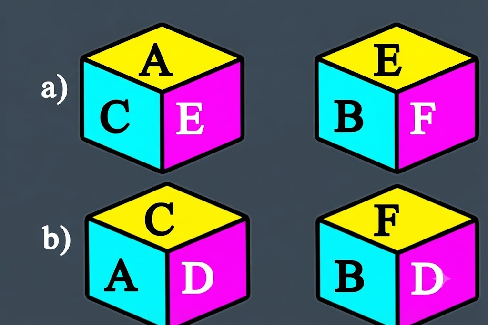

# Slide-by-slide reference — Data Sufficiency

**Original deck:** `Data Sufficiency-1.pptx`
**Slides:** 30

Every source slide is numbered below. Text is extracted from its text boxes and tables; image objects are linked in reading order. Slide graphics can have data and equations that are not present as editable text.

## Slide 01

### On-slide text

- DATA SUFFICIENCY
- Mrs. G . Devi
- Aptitude Trainer
- Department of Training & Placement
- Aditya University

## Slide 02

### On-slide text

- Wednesday, September 30, 2026
- PALURI HARI                          APTITUDE TRAINER            DEPT. OF TRAINING
- Introduction
- Data Sufficiency is a type of Logical Reasoning and Quantitative Aptitude problem.
- It tests whether the given information is enough to answer a question.
- 👉 We do NOT always need to find the answer.👉 We only need to check whether the information is sufficient or insufficient.

## Slide 03

### On-slide text

- Wednesday, September 30, 2026
- PALURI HARI                          APTITUDE TRAINER            DEPT. OF TRAINING
- A question is given with two statements: I and II.
- We need to decide:
- Is Statement I enough?
- Is Statement II enough?
- Are both together needed?
- Or is the information still not enough?
- Main Skill:
- Check the information → Don't unnecessarily solve the problem.

## Slide 04

### On-slide text

- Wednesday, September 30, 2026
- PALURI HARI                          APTITUDE TRAINER            DEPT. OF TRAINING
- Standard Options
- For most Data Sufficiency questions:
- A) Statement I alone is sufficient
- B) Statement II alone is sufficient
- C) Either I or II alone is sufficient
- D) Both I and II together are sufficient
- E) Even both I and II together are not sufficient

## Slide 05

### On-slide text

- Wednesday, September 30, 2026
- PALURI HARI                          APTITUDE TRAINER            DEPT. OF TRAINING
- 1) Among M, P, T, R and W each being of a different age, who is the youngest?
- I. T is younger than only P and W.
- II. M is younger than T and older than R.
- A) Statement I alone is sufficient
- B) Statement II alone is sufficient
- C) Either I or II alone is sufficient
- D) Both I and II together are sufficient
- E) Even both I and II together are not sufficient

## Slide 06

### On-slide text

- Wednesday, September 30, 2026
- PALURI HARI                          APTITUDE TRAINER            DEPT. OF TRAINING
- 2) How many daughters does Arun have?
- I. Arun has four children.
- II. Bijli and Chandani are sisters of Dilawar who is son of Arun.
- A) Statement I alone is sufficient
- B) Statement II alone is sufficient
- C) Either I or II alone is sufficient
- D) Both I and II together are sufficient
- E) Even both I and II together are not sufficient

## Slide 07

### On-slide text

- Wednesday, September 30, 2026
- PALURI HARI                          APTITUDE TRAINER            DEPT. OF TRAINING
- 3) Who is the tallest among the brothers A, B, C, D ?
- I)  C is shorter than only B
- II)  D is taller than only A
- A) Statement I alone is sufficient
- B) Statement II alone is sufficient
- C) Either I or II alone is sufficient
- D) Both I and II together are sufficient
- E) Even both I and II together are not sufficient

## Slide 08

### On-slide text

- Wednesday, September 30, 2026
- PALURI HARI                          APTITUDE TRAINER            DEPT. OF TRAINING
- 4) Is F the granddaughter of B?
- I) B is the father of M. M is the sister of T. T is the mother of F..
- II) S is the son of F. V is the daughter of F. R is the brother of T.
- A) Statement I alone is sufficient
- B) Statement II alone is sufficient
- C) Either I or II alone is sufficient
- D) Both I and II together are sufficient
- E) Even both I and II together are not sufficient

## Slide 09

### On-slide text

- Wednesday, September 30, 2026
- PALURI HARI                          APTITUDE TRAINER            DEPT. OF TRAINING
- 5) The last Sunday of March, 2004 fell on which date?
- Statements:
- I) The first Sunday of that month fell on 5th.
- II) The last day of that month was Friday.
- A) Statement I alone is sufficient
- B) Statement II alone is sufficient
- C) Either I or II alone is sufficient
- D) Both I and II together are sufficient
- E) Even both I and II together are not sufficient

## Slide 10

### On-slide text

- Wednesday, September 30, 2026
- PALURI HARI                          APTITUDE TRAINER            DEPT. OF TRAINING
- 6) What is the code for 'Clear' in the code language ?
- Statements:
- I) In the code language, 'Earth is clear' is written as 'de ra fa’.
- II) In the same code language, 'make it clear' is written as 'de ga jo’.
- A) Statement I alone is sufficient
- B) Statement II alone is sufficient
- C) Either I or II alone is sufficient
- D) Both I and II together are sufficient
- E) Even both I and II together are not sufficient

## Slide 11

### On-slide text

- Wednesday, September 30, 2026
- PALURI HARI                          APTITUDE TRAINER            DEPT. OF TRAINING
- 7) Four friends reside in four floors apartment (Ground floor is the first floor). one friend resides at one floor. On which floor does Ravi reside?
- I) Rakesh resides at top floor. Ravi does not reside odd number floor.
- II) Ravi resides neither at ground floor nor at even number floors.
- A) Statement I alone is sufficient
- B) Statement II alone is sufficient
- C) Either I or II alone is sufficient
- D) Both I and II together are sufficient
- E) Even both I and II together are not sufficient

## Slide 12

### On-slide text

- Wednesday, September 30, 2026
- PALURI HARI                          APTITUDE TRAINER            DEPT. OF TRAINING
- 8) Who amongst five friends O, P, Q, R and S is the tallest?
- Statements:
- I) Only one friend is taller than P, who is taller than S and O.
- II) R is taller than P.
- A) Statement I alone is sufficient
- B) Statement II alone is sufficient
- C) Either I or II alone is sufficient
- D) Both I and II together are sufficient
- E) Even both I and II together are not sufficient

## Slide 13

### On-slide text

- Wednesday, September 30, 2026
- PALURI HARI                          APTITUDE TRAINER            DEPT. OF TRAINING
- 9) P have three children. How many sons does P have ?
- Statements:
- I) M and K are sisters of G.
- II) J who has only two daughters, is mother of K and wife of P.
- A) Statement I alone is sufficient
- B) Statement II alone is sufficient
- C) Either I or II alone is sufficient
- D) Both I and II together are sufficient
- E) Even both I and II together are not sufficient

## Slide 14

### On-slide text

- Wednesday, September 30, 2026
- PALURI HARI                          APTITUDE TRAINER            DEPT. OF TRAINING
- 10) Village K is towards which direction of village N ?
- Statements:
- I) Village M is to the North of Village N and to the East of Village K.
- II) Village D is to west of Village N and to the South of Village K.
- A) Statement I alone is sufficient
- B) Statement II alone is sufficient
- C) Either I or II alone is sufficient
- D) Both I and II together are sufficient
- E) Even both I and II together are not sufficient

## Slide 15

### On-slide text

- Wednesday, September 30, 2026
- PALURI HARI                          APTITUDE TRAINER            DEPT. OF TRAINING
- 11) On which date of the month was Hari born in February 2004?
- Statements:
- I) Hari was born on an even date of the month.
- II) Hari 's birth date was a prime number.
- A) Statement I alone is sufficient
- B) Statement II alone is sufficient
- C) Either I or II alone is sufficient
- D) Both I and II together are sufficient
- E) Even both I and II together are not sufficient

## Slide 16

### On-slide text

- Wednesday, September 30, 2026
- PALURI HARI                          APTITUDE TRAINER            DEPT. OF TRAINING
- 12) In a row of 30 students facing North, What is Deepika’s position from the right end ?
- Statements:
- I) Hari is fifth to the right of Deepika and 18th from the left end of the row.
- II) Vijay is third to the left of Deepika and 11th from the right end of the row.
- A) Statement I alone is sufficient
- B) Statement II alone is sufficient
- C) Either I or II alone is sufficient
- D) Both I and II together are sufficient
- E) Even both I and II together are not sufficient

## Slide 17

### On-slide text

- Wednesday, September 30, 2026
- PALURI HARI                          APTITUDE TRAINER            DEPT. OF TRAINING
- 13) What is the code for ‘Vijay' in the code language ?
- Statements:
- 1.In the code language, ‘Vijay is Brilliant' is written as ‘pa sa na'.
- 2.In the same code language, 'make it clear' is written as ‘ne ta ke’.
- A) Statement I alone is sufficient
- B) Statement II alone is sufficient
- C) Either I or II alone is sufficient
- D) Both I and II together are sufficient
- E) Even both I and II together are not sufficient

## Slide 18

### On-slide text

- Wednesday, September 30, 2026
- PALURI HARI                          APTITUDE TRAINER            DEPT. OF TRAINING
- 14) On which day of the week did Kamesh visit Varanasi ?
- Statements:
- I) Kamesh visited Varanasi after Monday but before Wednesday
- II) Kamesh visited Varanasi before Friday but after Monday.
- A) Statement I alone is sufficient
- B) Statement II alone is sufficient
- C) Either I or II alone is sufficient
- D) Both I and II together are sufficient
- E) Even both I and II together are not sufficient

## Slide 19

### On-slide text

- Wednesday, September 30, 2026
- PALURI HARI                          APTITUDE TRAINER            DEPT. OF TRAINING
- 15) Among A, B, C, D and E sitting in a row, facing North, who sits exactly in the middle of the line ?
- Statements:
- I)  D sits third to the left of B. D is an immediate neighbour of both A and E.
- II) Two people sit between E and C. C does not sit at either of the extreme ends. A sits second to the right of E.
- A) Statement I alone is sufficient
- B) Statement II alone is sufficient
- C) Either I or II alone is sufficient
- D) Both I and II together are sufficient
- E) Even both I and II together are not sufficient

## Slide 20

### On-slide text

- Wednesday, September 30, 2026
- PALURI HARI                          APTITUDE TRAINER            DEPT. OF TRAINING
- 16) On which day was Prudhvi was born ?(His date of birth is February 29th)
- Statements:
- I) He was born between the year 2009 and 2015.
- II) He will complete 4 years on February 29th,2016.
- A) Statement I alone is sufficient
- B) Statement II alone is sufficient
- C) Either I or II alone is sufficient
- D) Both I and II together are sufficient
- E) Even both I and II together are not sufficient

## Slide 21

### On-slide text

- Wednesday, September 30, 2026
- PALURI HARI                          APTITUDE TRAINER            DEPT. OF TRAINING
- 17) Six actors are sitting in a line facing the North, Who is sitting to the immediate right of L ?
- Statements:
- I) A is sitting at the first position, and G is sitting third to the right of A. H is sitting to the immediate right of G.
- II) F is sitting second to the right of A. L is sitting to the immediate right of A. S is sitting at the end of the line.
- A) Statement I alone is sufficient
- B) Statement II alone is sufficient
- C) Either I or II alone is sufficient
- D) Both I and II together are sufficient
- E) Even both I and II together are not sufficient

## Slide 22

### On-slide text

- Wednesday, September 30, 2026
- PALURI HARI                          APTITUDE TRAINER            DEPT. OF TRAINING
- 18) How Old is Shekar ?
- Statements:
- I) Venkat is two years older than Shekar, who is twice as old as Aditya.
- II) If the total of the ages of Venkat, Shekar and Aditya be 62.
- A) Statement I alone is sufficient
- B) Statement II alone is sufficient
- C) Either I or II alone is sufficient
- D) Both I and II together are sufficient
- E) Even both I and II together are not sufficient

## Slide 23

### On-slide text

- Wednesday, September 30, 2026
- PALURI HARI                          APTITUDE TRAINER            DEPT. OF TRAINING
- 19) Two different positions of the same dice are shown, the six faces of which are marked by the letters A, B, C, D, E and F. which letter will be on the face opposite to the one showing ‘D’ ?
- Statements:
- A) Statement I alone is sufficient
- B) Statement II alone is sufficient
- C) Either I or II alone is sufficient
- D) Both I and II together are sufficient
- E) Even both I and II together are not sufficient

### Original visuals / picture-based questions

## Slide 24

### On-slide text

- Wednesday, September 30, 2026
- PALURI HARI                          APTITUDE TRAINER            DEPT. OF TRAINING
- 20) Among five friends, who among them is the highest scorer?
- Statements:
- I) Shekar scored higher marks than Kamesh, but lower than Vijay.
- II) Hari Scored higher marks than Teja, but lower than Kamesh.
- A) Statement I alone is sufficient
- B) Statement II alone is sufficient
- C) Either I or II alone is sufficient
- D) Both I and II together are sufficient
- E) Even both I and II together are not sufficient

## Slide 25

### On-slide text

- Wednesday, September 30, 2026
- PALURI HARI                          APTITUDE TRAINER            DEPT. OF TRAINING
- 21) How many people are standing in the row if A, R, M and B are among the people standing in it where all people are facing north?
- Statements:
- I) A is fourth from the left end; M is second to the right of A; and R is second from the left end.
- II) M is fourth from the right end; only two people stand between M and B. B is to the right of M.
- A) Statement I alone is sufficient
- B) Statement II alone is sufficient
- C) Either I or II alone is sufficient
- D) Both I and II together are sufficient
- E) Even both I and II together are not sufficient

## Slide 26

### On-slide text

- Wednesday, September 30, 2026
- PALURI HARI                          APTITUDE TRAINER            DEPT. OF TRAINING
- 22) Six people - A, B, C, D, E and F are sitting in a straight line facing north. Who sits to the immediate left of D?
- Statements:
- I) A sits second from one of the extreme ends of the line. Only two people sit between A and B. E sits to the immediate right of C.
- II) C sits third from the left end of the line. Only one person sits between C and F. E sits third to the right of F.
- A) Statement I alone is sufficient
- B) Statement II alone is sufficient
- C) Either I or II alone is sufficient
- D) Both I and II together are sufficient
- E) Even both I and II together are not sufficient

## Slide 27

### On-slide text

- Wednesday, September 30, 2026
- PALURI HARI                          APTITUDE TRAINER            DEPT. OF TRAINING
- 23) What is the total number of Students in a Class?
- Statements:
- I) There are 20 boys in the class.
- II) The ratio of girls to boys in the class is 2:5.
- A) Statement I alone is sufficient
- B) Statement II alone is sufficient
- C) Either I or II alone is sufficient
- D) Both I and II together are sufficient
- E) Even both I and II together are not sufficient

## Slide 28

### On-slide text

- Wednesday, September 30, 2026
- PALURI HARI                          APTITUDE TRAINER            DEPT. OF TRAINING
- 24) What will be the code for "big"?
- Statements:
- I) In a certain code language, "butterfly is beautiful" is written as "es je ik"
- II) In the same code language, "box is big" is written as "ik ej ze" and "blow the big balloon" is written as "ze ak xo il“
- A) Statement I alone is sufficient
- B) Statement II alone is sufficient
- C) Either I or II alone is sufficient
- D) Both I and II together are sufficient
- E) Even both I and II together are not sufficient

## Slide 29

### On-slide text

- Wednesday, September 30, 2026
- PALURI HARI                          APTITUDE TRAINER            DEPT. OF TRAINING
- 25) How many pencils does the shopkeeper sells on Sunday ?
- Statements:
- I) On Sunday he sold 12 more pencils than he sold the previous day.
- II) He sold 28 pencils each on Thursday and Saturday.
- A) Statement I alone is sufficient
- B) Statement II alone is sufficient
- C) Either I or II alone is sufficient
- D) Both I and II together are sufficient
- E) Even both I and II together are not sufficient

## Slide 30

### On-slide text

- Thank You
- Wednesday, September 30, 2026
- PALURI HARI                          APTITUDE TRAINER            DEPT. OF TRAINING

